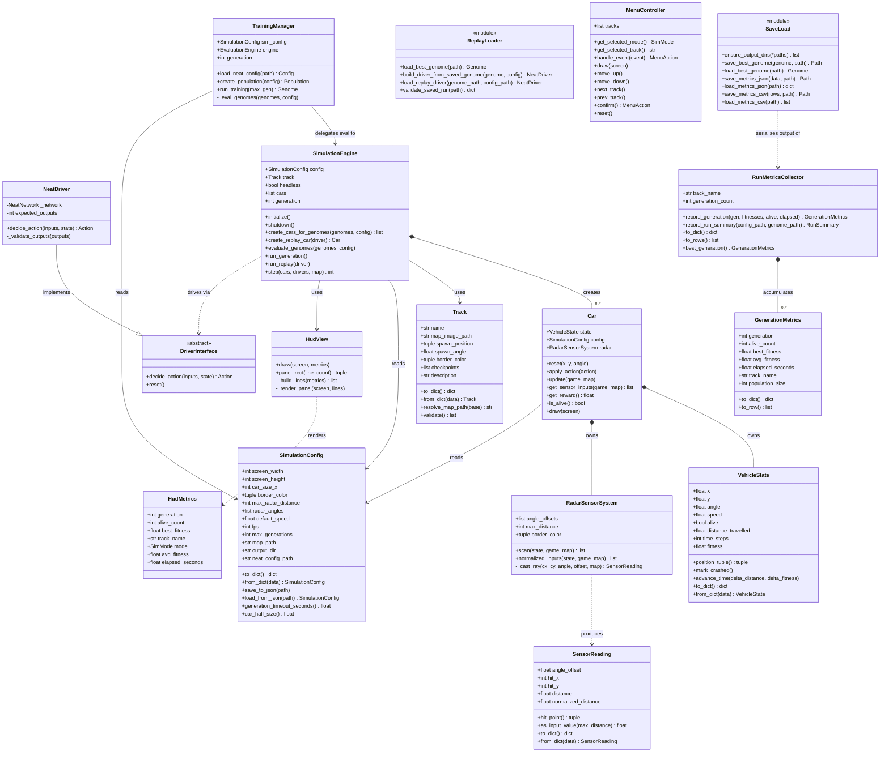

# Architecture Documentation

## 1. Project Overview

This project is a refactored, modular Python package derived from the
[NeuralNine/ai-car-simulation](https://github.com/NeuralNine/ai-car-simulation)
prototype. The original codebase was a single-file script (`newcar.py`) that
combined physics, rendering, NEAT training, and collision detection in one
monolithic class. This refactor separates every concern into its own focused
module, adds a full pytest suite, and makes the project runnable as a proper
installable Python package.

### What was expanded from the baseline

| Area | Original | Refactored |
|---|---|---|
| Structure | Single file `newcar.py` | 8-layer package under `src/ai_car_sim/` |
| Configuration | Hardcoded constants | `SimulationConfig` dataclass with JSON I/O |
| Car state | Attributes on `Car` class | Separate `VehicleState` domain object |
| Radar | Inline in `Car.update()` | `RadarSensorSystem` with `SensorReading` objects |
| Collision | Inline in `Car.check_collision()` | `collision_service` pure functions |
| AI driver | Inline NEAT activation | `DriverInterface` protocol + `NeatDriver` adapter |
| Training | Inline `run_simulation()` | `TrainingManager` orchestrator |
| Replay | Not supported | `ReplayLoader` + dedicated engine path |
| Persistence | Not supported | `save_load` module (pickle, JSON, CSV) |
| Analytics | Not supported | `RunMetricsCollector` + `GenerationMetrics` |
| UI | Inline pygame calls | `HudView` + `MenuController` components |
| Testing | None | 428 pytest tests, all headless |

---

## 2. Package Responsibilities

```
src/ai_car_sim/
├── domain/          Pure data models — no logic, no I/O
│   ├── track.py             Track metadata and spawn info
│   ├── vehicle_state.py     Mutable car physics state
│   ├── sensor_reading.py    One radar ray result
│   └── simulation_config.py All tunable parameters
│
├── core/            Physics, geometry, sensing — no pygame rendering
│   ├── vector_utils.py      Pure math helpers (distance, rotate, clamp)
│   ├── collision_service.py Corner calculation + border pixel check
│   ├── radar_sensor.py      Ray-marching radar system
│   └── car.py               Car entity composing state + sensors
│
├── ai/              Driver abstraction and NEAT integration
│   ├── driver_interface.py  Action enum + DriverInterface ABC
│   ├── neat_driver.py       NEAT network → DriverInterface adapter
│   ├── training_manager.py  NEAT population lifecycle orchestrator
│   └── replay_loader.py     Load saved genome → driver for replay
│
├── ui/              pygame rendering components
│   ├── hud_view.py          On-screen status overlay
│   └── menu_controller.py   Pre-simulation mode/track selection menu
│
├── simulation/      Main loop orchestration
│   └── engine.py            SimulationEngine — owns display, clock, frame loop
│
├── analytics/       Metrics collection
│   └── run_metrics.py       GenerationMetrics + RunMetricsCollector
│
├── persistence/     File I/O
│   └── save_load.py         Genome pickle, metrics JSON/CSV helpers
│
└── main.py          CLI entrypoint and application bootstrap
```

---

## 3. Runtime Modes

### Training mode
```
main() → run_training()
  └─ TrainingManager.run_training()
       └─ neat.Population.run(eval_genomes, N)
            └─ SimulationEngine.evaluate_genomes()   [called each generation]
                 ├─ create_cars_for_genomes()         [one Car + NeatDriver per genome]
                 ├─ run_generation()                  [frame loop until timeout/all crashed]
                 │    └─ step() × N ticks
                 │         ├─ Car.get_sensor_inputs()
                 │         ├─ NeatDriver.decide_action()
                 │         ├─ Car.apply_action()
                 │         └─ Car.update()
                 └─ genome.fitness = car.get_reward()
```

### Replay mode
```
main() → run_replay()
  └─ load_replay_driver(genome_path, neat_config_path)
       └─ SimulationEngine.run_replay(driver)
            └─ frame loop (same step() logic, single car)
```

### Menu mode (default)
```
main() → run_menu()
  └─ MenuController event loop
       └─ on CONFIRM → run_training() or run_replay()
```

---

## 4. Class Diagram



---

## 5. Key Design Decisions

### Protocols over concrete imports
`RadarSensorSystem`, `collision_service`, and `SimulationEngine` all accept a
`MapSurface` protocol (any object with `get_at` + `get_size`) rather than a
concrete `pygame.Surface`. This lets every module load and be tested without
an active display.

### Lazy pygame imports
All pygame calls are inside methods that are only reached at runtime
(`draw`, `_render_frame`, `_ensure_fonts`). Module-level imports are
stdlib-only, so the entire package imports cleanly in headless CI.

### Non-fatal saves, raising loads
`save_best_genome`, `save_metrics_json`, and `save_metrics_csv` log a warning
and return `None` on failure — a mid-training crash should not lose the run.
`load_*` functions raise descriptive exceptions so callers know immediately
when a file is missing or corrupt.

### Action enum as the AI boundary
`Action(IntEnum)` in `driver_interface.py` is the single shared vocabulary
between the simulation engine and any driver. Adding a new driver (manual
keyboard, scripted, another ML algorithm) only requires implementing
`decide_action(inputs, state) -> Action`.

---

## 6. Testing Strategy

All 428 tests are headless. The key patterns used:

- **Mock surfaces** — `OpenSurface` / `BorderSurface` stubs implement the
  `MapSurface` protocol with no pygame dependency.
- **Picklable stubs** — `@dataclass FakeGenome` instead of `MagicMock` for
  any test that exercises pickle round-trips.
- **Protocol stubs** — `StubEngine` (5 lines) satisfies `EvaluationEngine`
  for `TrainingManager` tests without a display.
- **Pure helper isolation** — `HudView._build_lines()`, `MenuController.move_up()`,
  `panel_rect()` are pure methods tested directly without touching pygame.
- **Hypothesis property tests** — `test_properties.py` uses `@given` to
  verify module docstrings, `__init__.py` presence, and dependency-check
  behaviour across sampled inputs.

```
pytest                              # run all 428 tests
pytest --cov=ai_car_sim             # with coverage
pytest tests/test_vector_utils.py   # single module
```

---

## 7. Future Extension Ideas

| Idea | Where to add it |
|---|---|
| Checkpoint-based fitness | `VehicleState.checkpoint_index` + `Track.checkpoints` already exist |
| Recurrent NEAT driver | Subclass `DriverInterface`, override `reset()` to clear hidden state |
| Manual keyboard driver | New `KeyboardDriver(DriverInterface)` in `ai/` |
| Multiple simultaneous tracks | Pass a list of `Track` to `TrainingManager` |
| Web dashboard for metrics | Export `RunMetricsCollector.to_dict()` to a Flask/FastAPI endpoint |
| Continuous action space | Replace `Action(IntEnum)` with a `SteeringAction(float, float)` |
| Saved replay playback | Serialize `(action, state)` pairs per tick in `persistence/` |
